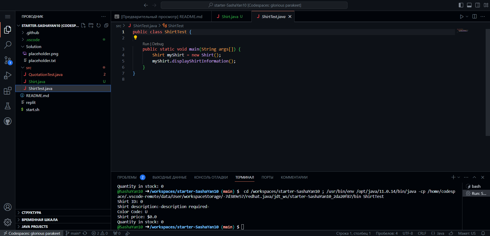
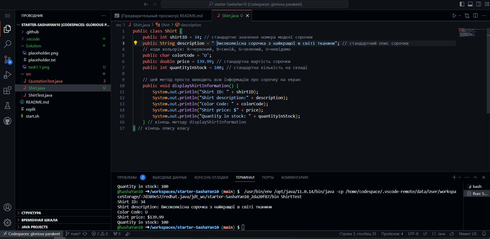
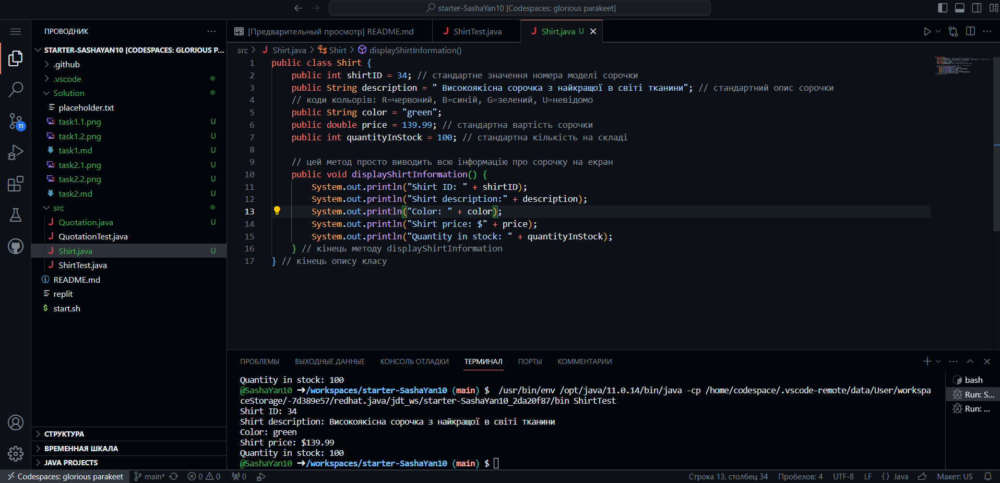

# Завдання 1 - сорочки

1) **1-6 пункти завдання**

Результат:


Код:
```java
public class Shirt {
    public int shirtID = 0; // стандартне значення номера моделі сорочки
    public String description = "-description required-"; // стандартний опис сорочки
    // коди кольорів: R=червоний, B=синій, G=зелений, U=невідомо
    public char colorCode = 'U';
    public double price = 0.0; // стандартна вартість сорочки
    public int quantityInStock = 0; // стандартна кількість на складі

    // цей метод просто виводить всю інформацію про сорочку на екран
    public void displayShirtInformation() {
        System.out.println("Shirt ID: " + shirtID);
        System.out.println("Shirt description:" + description);
        System.out.println("Color Code: " + colorCode);
        System.out.println("Shirt price: $" + price);
        System.out.println("Quantity in stock: " + quantityInStock);
    } // кінець методу displayShirtInformation
} // кінець опису класу
```

2) **7-11 пункти завдання**

Результат:


Код:
```java
public class Shirt {
    public int shirtID = 34; // стандартне значення номера моделі сорочки
    public String description = " Високоякісна сорочка з найкращої в світі тканини"; // стандартний опис сорочки
    // коди кольорів: R=червоний, B=синій, G=зелений, U=невідомо
    public char colorCode = 'U';
    public double price = 139.99; // стандартна вартість сорочки
    public int quantityInStock = 100; // стандартна кількість на складі

    // цей метод просто виводить всю інформацію про сорочку на екран
    public void displayShirtInformation() {
        System.out.println("Shirt ID: " + shirtID);
        System.out.println("Shirt description:" + description);
        System.out.println("Color Code: " + colorCode);
        System.out.println("Shirt price: $" + price);
        System.out.println("Quantity in stock: " + quantityInStock);
    } // кінець методу displayShirtInformation
} // кінець опису класу
```

*Додаткове завдання*

Результат:


Код:
```java
public class Shirt {
    public int shirtID = 34; // стандартне значення номера моделі сорочки
    public String description = " Високоякісна сорочка з найкращої в світі тканини"; // стандартний опис сорочки
    // коди кольорів: R=червоний, B=синій, G=зелений, U=невідомо
    public String color = "green";
    public double price = 139.99; // стандартна вартість сорочки
    public int quantityInStock = 100; // стандартна кількість на складі

    // цей метод просто виводить всю інформацію про сорочку на екран
    public void displayShirtInformation() {
        System.out.println("Shirt ID: " + shirtID);
        System.out.println("Shirt description:" + description);
        System.out.println("Color: " + color);
        System.out.println("Shirt price: $" + price);
        System.out.println("Quantity in stock: " + quantityInStock);
    } // кінець методу displayShirtInformation
} // кінець опису класу
```