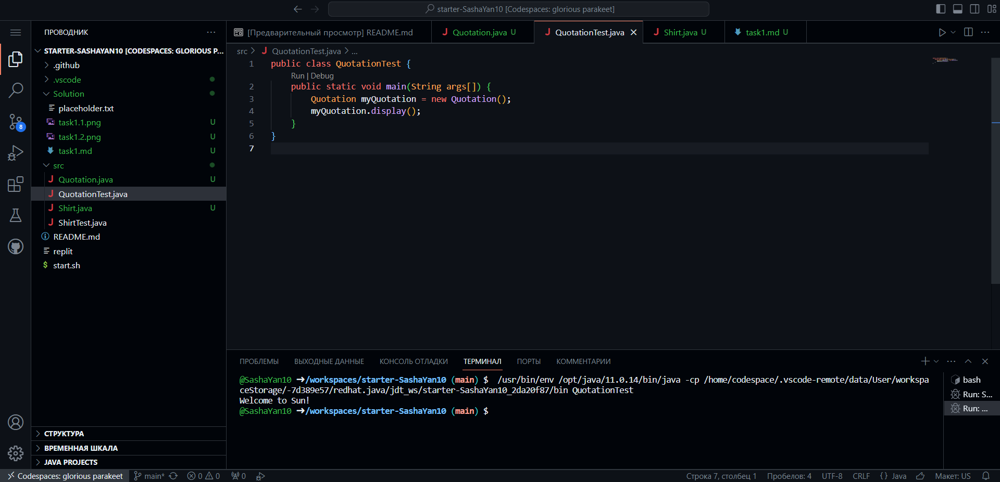
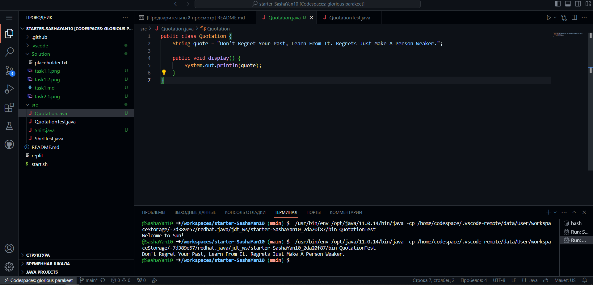
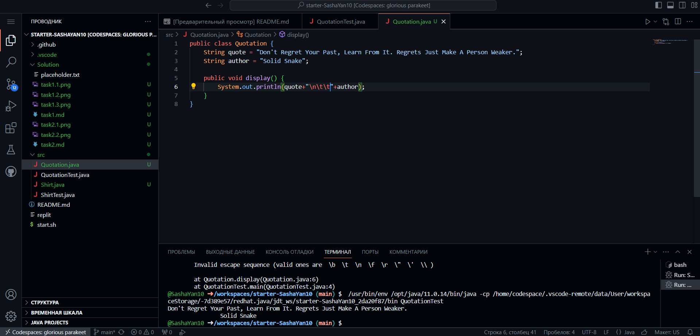

# Завдання 2 - цитата

1) **1-5 пункти завдання**

Резуьтат:


Код:
```java
public class Quotation {
    String quote = "Welcome to Sun!";

    public void display() {
        System.out.println(quote);
    }
}
```

2) **6-10 пункти завдання**

Результат:


Код:
```java
public class Quotation {
    String quote = "Don't Regret Your Past, Learn From It. Regrets Just Make A Person Weaker.";

    public void display() {
        System.out.println(quote);
    }
}
```

*Додаткове завдання*

Результат:


Код:
```java
public class Quotation {
    String quote = "Don't Regret Your Past, Learn From It. Regrets Just Make A Person Weaker.";
    String author = "Solid Snake";

    public void display() {
        System.out.println(quote+"\n\t\t"+author);
    }
}
```